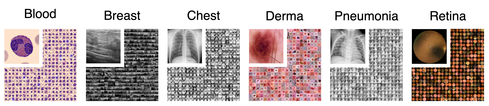
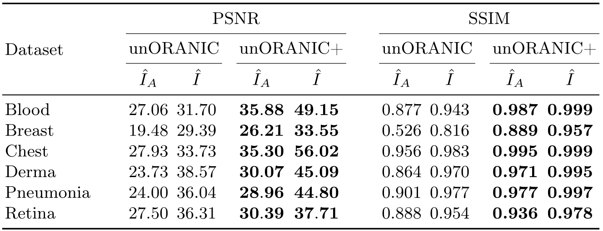

# unoranic-plus
Official code repository for the paper "Unsupervised Feature Orthogonalization for Learning Distortion-Invariant Representations"

## Overview 🧠
We introduce unORANIC+, a novel method that integrates unsupervised feature orthogonalization with the ability of a Vision Transformer to capture both local and global relationships for improved robustness and generalizability. The streamlined architecture of unORANIC+ effectively separates anatomical and image-specific attributes, resulting in robust and unbiased latent representations that allow the model to demonstrate excellent performance across various medical image analysis tasks and diverse datasets. Extensive experimentation demonstrates unORANIC+’s reconstruction proficiency, corruption resilience, as well as distortion revision capability. Additionally, the model exhibits notable aptitude in downstream tasks such as disease classification
and corruption detection. We confirm its adaptability to diverse datasets of varying image sources and sample sizes which positions the method as a promising algorithm for advanced medical image analysis, particularly in resource-constrained environments lacking large, tailored, labeled datasets.

<p align="middle">
  
</p>

Figure 1: Schematic representation of the training pipeline for the refined unORANIC+ for chest X-ray images. The polar arrows illustrate the forward
propagation and gradient flow, respectively.

Subsequent sections outline the paper's [key contributions](#key-contributions-), showcase the [obtained results](#results-), and offer instructions on [accessing and utilizing the accompanying codebase](#getting-started-) to replicate the findings and train or evaluate your own models.

## Key Contributions 🔑
- **Enhanced Feature Orthogonalization:** unORANIC+ synergizes unsupervised feature orthogonalization with a Vision Transformer’s ability to
capture global-local relationships for improved robustness and generalizability.
- **Streamlined Architecture:** With a single encoder, unORANIC+ effectively disentangles anatomical and image attributes, yielding robust latent
representations to allow superior performance in a wide range of tasks.
- **Versatility Across Datasets:** Extensive quantitative experimentation across various datasets and medical conditions displays unORANIC+’s performance
and versatility.

## Results 📊
We comprehensively evaluate unORANIC+ in terms of [reconstruction quality](#image-reconstruction-quality), capability to revise existing corruptions, corruption robustness, and its effectiveness in downstream tasks such as disease classification and corruption detection. To allow a fair comparison with its predecessor *unORANIC*, we utilize the same diverse selection of $28 \times 28$ biomedical 2D datasets from the [MedMNIST v2 benchmark](https://medmnist.com/) the original method was evaluated on, including breastMNIST ($546$ training samples), retinaMNIST ($1,080$), pneumoniaMNIST ($4,078$), dermaMNIST ($7,007$), and bloodMNIST ($11,959$). Additionally, we assess all models on the larger chestMNIST dataset ($78,468$ training samples) as well. Finally, in addressing a major limitation of unORANIC, which was exclusively evaluated on $28 \times 28$ images, we investigate unORANIC+’s potential to handle higher dimensional data as well. This is achieved by adopting a higher resolution version (bloodHD) of the bloodMNIST dataset comprising images of $224 \times 224$ pixels, by using the original data samples in combination with the MedMNIST train-, validation-, and test-splits.

<p align="middle">
  
</p>

Figure 2: Examples from the datasets of the [MedMNIST v2 benchmark](https://medmnist.com/) used for evaluating our approach (left to right: bloodMNIST, breastMNIST, chestMNIST, dermaMNIST, pneumoniaMNIST, retinaMNIST).

### Image Reconstruction Quality

<p align="middle">
  
</p>

Table 1: Comparison of average Peak Signal-to-Noise Ratio (PSNR) and Structural Similarity Index Metric (SSIM) values for the anatomical reconstructions ($\hat I_A$) and the reconstructions of the original input ($\hat I_ \ $) given an uncorrupted input image $(I)$ between unORANIC and unORANIC+ on the test sets of various datasets.

### Corruption Revision Capability

<p align="middle">
  
</p>

Table 1: 

### Disease classification and corruption detection
<p align="middle">
  
</p>

Figure 3: 

## Getting Started 🚀
### Project Structure
- TBD

### Installation and Requirements
#### Clone this Repository:
To clone this repository to your local machine, use the following command:
```
git clone https://github.com/sdoerrich97/unoranic-plus.git
```

#### Set up a Python Environment Using Conda (Recommended) 
If you don't have Conda installed, you can download and install it from [here](https://conda.io/projects/conda/en/latest/index.html).
Once Conda is installed, create a Conda environment with Python 3 (>= 3.8) in your terminal:
```
conda create --name unoranicPlus python=3.8
```
Of course, you can use a standard Python distribution as well.

#### Install Required Packages From the Terminal Using Conda (Recommended)
TBD

# Citation 📖
If you find this work useful in your research, please consider citing our paper:
- Publication: TBD
- Preprint: TBD

