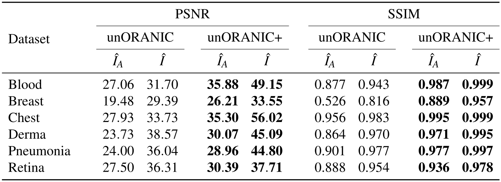
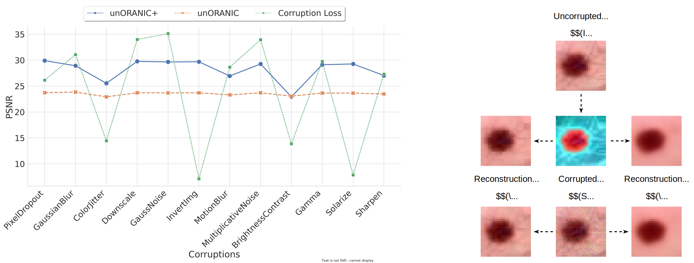

# unoranic-plus
Official code repository for the paper "Unsupervised Feature Orthogonalization for Learning Distortion-Invariant Representations"

## Overview 🧠
We introduce unORANIC+, a novel method that integrates unsupervised feature orthogonalization with the ability of a Vision Transformer to capture both local and global relationships for improved robustness and generalizability. The streamlined architecture of unORANIC+ effectively separates anatomical and image-specific attributes, resulting in robust and unbiased latent representations that allow the model to demonstrate excellent performance across various medical image analysis tasks and diverse datasets. Extensive experimentation demonstrates unORANIC+’s reconstruction proficiency, corruption resilience, as well as distortion revision capability. Additionally, the model exhibits notable aptitude in downstream tasks such as disease classification
and corruption detection. We confirm its adaptability to diverse datasets of varying image sources and sample sizes which positions the method as a promising algorithm for advanced medical image analysis, particularly in resource-constrained environments lacking large, tailored, labeled datasets.

<p align="middle">
  
</p>

Figure 1: Schematic representation of the training pipeline for the refined unORANIC+ for chest X-ray images. The polar arrows illustrate the forward
propagation and gradient flow, respectively.

Subsequent sections outline the paper's [key contributions](#key-contributions-), showcase the [obtained results](#results-), and offer instructions on [accessing and utilizing the accompanying codebase](#getting-started-) to replicate the findings and train or evaluate your own models.

## Key Contributions 🔑
- **Enhanced Feature Orthogonalization:** unORANIC+ synergizes unsupervised feature orthogonalization with a Vision Transformer’s ability to
capture global-local relationships for improved robustness and generalizability.
- **Streamlined Architecture:** With a single encoder, unORANIC+ effectively disentangles anatomical and image attributes, yielding robust latent
representations to allow superior performance in a wide range of tasks.
- **Versatility Across Datasets:** Extensive quantitative experimentation across various datasets and medical conditions displays unORANIC+’s performance
and versatility.

## Results 📊
We comprehensively evaluate unORANIC+ in terms of [reconstruction quality](#image-reconstruction-quality), [capability to revise existing corruptions](#corruption-revision-capability), corruption robustness, and its effectiveness in downstream tasks such as disease classification and corruption detection. To allow a fair comparison with its predecessor *unORANIC*, we utilize the same diverse selection of $28 \times 28$ biomedical 2D datasets from the [MedMNIST v2 benchmark](https://medmnist.com/) the original method was evaluated on, including breastMNIST ($546$ training samples), retinaMNIST ($1,080$), pneumoniaMNIST ($4,078$), dermaMNIST ($7,007$), and bloodMNIST ($11,959$). Additionally, we assess all models on the larger chestMNIST dataset ($78,468$ training samples) as well. Finally, in addressing a major limitation of unORANIC, which was exclusively evaluated on $28 \times 28$ images, we investigate unORANIC+’s potential to handle higher dimensional data as well. This is achieved by adopting a higher resolution version (bloodHD) of the bloodMNIST dataset comprising images of $224 \times 224$ pixels, by using the original data samples in combination with the MedMNIST train-, validation-, and test-splits.

<p align="middle">
  
</p>

Figure 2: Examples from the datasets of the [MedMNIST v2 benchmark](https://medmnist.com/) used for evaluating our approach (left to right: bloodMNIST, breastMNIST, chestMNIST, dermaMNIST, pneumoniaMNIST, retinaMNIST).

### Image Reconstruction Quality

<p align="middle">
  
</p>

Table 1: Comparison of average Peak Signal-to-Noise Ratio (PSNR) and Structural Similarity Index Metric (SSIM) values for the anatomical reconstructions ($\hat I_A$) and the reconstructions of the original input ($\hat I_ \ $) given an uncorrupted input image $(I)$ between unORANIC and unORANIC+ on the test sets of various datasets.

### Corruption Revision Capability

<p align="middle">
  
</p>

Figure 3: Comparison of corruption revision capabilities between the predecessor unORANIC and unORANIC+. Left: their reconstruction consistency is depicted despite the corruption-related image quality loss, described here in terms of the PSNR between the original image $I$ and the corruption-respective distorted variant $S$ (green dotted line). Right: the illustration highlights the distortion correction capabilities of both methods using Gaussian noise as an example.

### Disease Classification, Corruption Detection, and Corruption Robustness Potential

<p align="middle">
  
</p>

Figure 4: Left: Comparison of the classification and corruption detection results on the bloodMNIST dataset. Results from fully supervised models, trained end-to-end, are indicated with $^ \dagger$. The highest overall performance is <ins>underlined</ins>, while the second best performance is indicated in **bold**. Right: Visualization of unORANIC+'s resilience to unseen corruptions compared to the reference models (unORANIC and the supervised ResNet-18 baseline), demonstrated by its robust disease classification performance for bloodMNIST even under the influence of unknown corruptions with rising severity, visualized through different textures (&nbsp;&nbsp;, $\cdot$ , $\times$). For reference, the plot contains the supervised classification benchmark (*i.e.,* ResNet-18) for uncorrupted images as well.

## Getting Started 🚀
### Project Structure
- [`assets`](https://github.com/sdoerrich97/unoranic-plus/tree/main/assets): Assets for the README
- [`configs`](https://github.com/sdoerrich97/unoranic-plus/tree/main/configs): Training/evaluation and experiment configurations
- [`experiments`](https://github.com/sdoerrich97/unoranic-plus/tree/main/experiments): Experiments presented in the paper
- [`models`](https://github.com/sdoerrich97/unoranic-plus/tree/main/models): Model structure
- [`training`](https://github.com/sdoerrich97/unoranic-plus/tree/main/training): Training and evaluation scripts
- [`environment.yaml`](https://github.com/sdoerrich97/unoranic-plus/tree/main/environment.yaml): Package Requirements
- [`utils.py`](https://github.com/sdoerrich97/unoranic-plus/blob/main/utils.py): Helper functions

### Installation and Requirements
#### Clone this Repository:
To clone this repository to your local machine, use the following command:
```
git clone https://github.com/sdoerrich97/unoranic-plus.git
```

#### Set up a Python Environment Using Conda (Recommended) 
If you don't have Conda installed, you can download and install it from [here](https://conda.io/projects/conda/en/latest/index.html).
Once Conda is installed, create a Conda environment with Python 3 (>= 3.8) in your terminal:
```
conda create --name unoranicPlus python=3.8
```
Of course, you can use a standard Python distribution as well.

#### Install Required Packages From the Terminal Using Conda (Recommended)
All required packages are listed in [`environment.yaml`](https://github.com/sdoerrich97/unoranic-plus/tree/main/environment.yaml).

Activate your Conda environment in your terminal:
```
conda activate unoranicPlus
```

Once Conda is activated, install PyTorch depending on your system's configuration. For example for Linux using Conda and CUDA 12.1 use the following command. For all other configurations refer to the official [PyTorch documentation](https://pytorch.org/):
```
conda install pytorch torchvision torchaudio pytorch-cuda=12.1 -c pytorch -c nvidia
```

Install required Python packages via Conda:
```
conda install conda-forge::matplotlib
conda install anaconda::seaborn
conda install fastai::timm
conda install conda-forge::torchmetrics
```

Additionally, navigate to your newly created Conda environment within your Conda install and install the remaining Python Packages from [PyPI](https://pypi.org/):
```
cd ../miniconda3/envs/scalableGenModels/Scripts
pip install medmnist
pip install imagecorruptions
pip install wandb
pip install -U albumentations
```

If you use a standard Python distribution instead, you need to adjust the installation steps accordingly.

### Quick Start
Once all requirements are installed, make sure the Conda environment is active and navigate to the project directory:
```
cd ../unoranic-plus
```

You can adjust the parameters and hyperparameters of each training/evaluation run within the respective copy within [`configs`](https://github.com/sdoerrich97/unoranic-plus/tree/main/configs).

Once the config files are all set, you can execute for example a training or inference run for the bloodmnist dataset using:
```
python training/train.py --config_file '../configs/training/config_bloodmnist.yaml'
python training/inference.py --config_file '../configs/training/config_bloodmnist.yaml'
```
Please note that the project uses relative import statements. **Thus, it is important that you execute the code from the project root.**

Additionally, you can adjust some parameters on the fly. Please check out the main()-function of each training/evaluation script to see what these are. In case you intend to use Weights & Biases to track your experiments, you need to set it up respectively: [W&B Quickstart](https://docs.wandb.ai/quickstart)

Lastly, you will find all parameters (model architectures, number of epochs, learning rate, etc.) we used for our benchmark within the provided config-files within [`configs`](https://github.com/sdoerrich97/unoranic-plus/tree/main/configs) in case you want to reproduce our results. If you want to use your own models and datasets, you only need to adjust the config-file, respectively.


# Citation 📖
If you find this work useful in your research, please consider citing our paper:
- Publication: TBD
- Preprint: TBD

